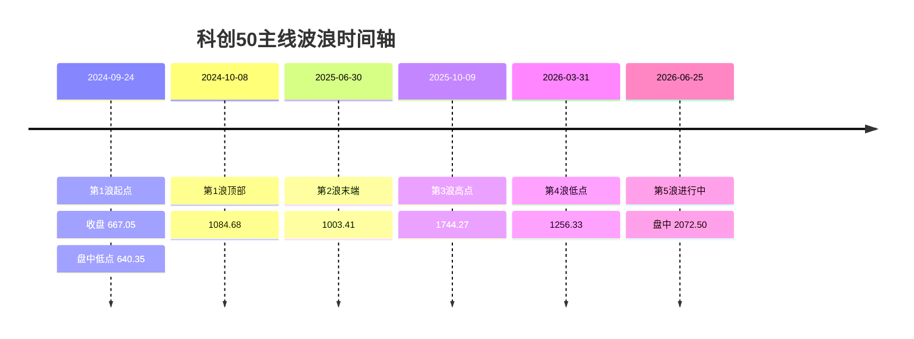

# 科创50指数波浪理论深度分析

## 执行摘要

基于截至 2026 年 6 月 25 日盘中可得的公开数据，我对科创50指数的首选判断是：**当前最可能处在用户主线假设中的第5浪，而且已经进入第5浪的中后段，而不是刚刚启动，也还没有形成足够强的“已经终结”确认**。我给这一主线计数的主观概率为 **约 52%**；“第5浪已逼近末端、随时可能演化为终结楔形/冲顶后回撤”的备选计数概率 **约 28%**；“当前其实仍属于更大级别第3浪的延伸结构，尚未完成大3”的备选计数概率 **约 20%**。之所以把主线放在首位，是因为从 2024 年 9 月低点到 2026 年 6 月新高，价格结构基本满足波浪理论最核心的三条推动浪规则；但之所以不给出更高置信度，是因为 2026 年 6 月的新高已经出现了**明显的广度收敛**与**估值高位**特征。 citeturn31search0turn31search1turn23search7turn34search11turn22search0turn37search1turn29search1turn42view0turn19search11

更大级别上，科创50在 2024 年 9 月 24 日盘中回落至 **640.35** 点附近、在当日收盘报 **667.05** 点后启动反弹；到 2026 年 5 月 11 日，指数盘中突破其 2020 年 7 月 **1726.19** 点历史高位并创出新高；到 2026 年 6 月 24 日收盘已升至 **1989.43** 点，再到 2026 年 6 月 25 日盘中最新报价达到 **2072.50** 点。换言之，**大方向上的“熊末转牛初”已经被历史新高所确认**，争议不再是“是否仍在大级别反弹”，而是“这轮上行在中级别上究竟是第5浪中段、末段，还是更大级别第3浪的延伸子结构”。 citeturn8search5turn23search7turn8search9turn30search1turn42view0

若按用户给定主线去落点，最顺手的枢纽并不是 2024 年 10 月 31 日，而是 **2024 年 10 月 8 日高点 1084.68**。这样一来，第1浪可视为 2024-09-24 至 2024-10-08，第2浪为 2024-10-08 至 2025-06-30，第3浪为 2025-07 至 2025-10-09，第4浪为 2025-10-09 至 2026-03-31，第5浪为 2026-04 至今。这个划分的优点在于：第2浪没有跌破第1浪起点；第3浪在涨幅上明显大于第1浪，不会成为最短推动浪；第4浪低点 **1256.33** 仍高于第1浪顶部 **1084.68**，没有与第1浪价格区间重叠。结构上是自洽的。 citeturn34search11turn22search0turn37search1turn29search1turn31search0turn31search1

但第5浪已经出现一个非常关键的“晚期信号”：**指数创新高，不代表板块全面共振**。2026 年 6 月 24 日，科创50收涨 **3.82%** 至 **1989.43** 点、成分股成交额约 **1946 亿元**，但科创板全市场仍是 **274 只上涨、328 只下跌**；到 2026 年 6 月 25 日 11:30 左右，指数再涨至 **2072.50** 点附近时，中财网页面显示科创板约 **160 只上涨、442 只下跌**。这说明新高越来越依赖权重半导体/AI 链条中的少数龙头，而不是整板块普涨，这通常更像第5浪后段，而不是第3浪中段最健康的扩散式上攻。 citeturn30search1turn30search2turn12view0turn42view0

交易含义上，我更偏向把当前看作“**第5浪趋势仍在，但追涨性价比已显著下降**”。顺势者仍然可以保留核心仓位，因为截至 2026-06-25 的日线技术快照仍显示 **RSI(14)=69.876、MACD(12,26)=57.37、ADX(14)=35.898**，且 MA5 到 MA200 全部处在“买入”区间；但战术上应把关注重点从“还能不能涨”转到“**一旦出现广度继续恶化、价格跌破短中期均线时，如何保住第5浪账面利润**”。 citeturn42view0turn40search10turn40search7

## 方法与数据

### 数据源与优先级

本报告优先使用**中文官方/原始来源**。第一优先级是上海证券交易所与指数编制相关文件，包括《上证科创板50成份指数编制方案》和上交所关于成交金额（量）口径变更的公告；第二优先级是上交所、新华财经、新华社、证券时报·数据宝等**按交易日发布的收盘播报/统计稿**；第三优先级才是英为财情、东方财富、中财网、Lixinger 等公开网页，用于补充最新盘中报价、技术指标快照、估值分位和图形口径。这样做的原因是：官方文件最适合界定指数样本、口径和可比性，交易日播报最适合锁定阶段高低点与成交额，而技术/估值网页更适合补最新时点的日线指标状态。 citeturn43search0turn44view0turn23search7turn32search5turn37search1turn29search1turn30search1turn42view0turn19search11

指数本身**不存在个股意义上的前复权/后复权问题**，因为它是指数点位，不是会分红送转导致价格断裂的单只股票。因此，本报告对**科创50主序列以“不复权指数点位”为准**。如果扩展到 ETF 或成份股代理序列，才需要以前复权为主；但在本次结论中，ETF/成份股仅被用于辅助观察，不作为主计数主序列。这个口径需要特别说明，因为用户提出了复权要求，但对指数本体而言，复权并非核心问题。 citeturn43search0

时间范围方面，报告主观察窗为 **2024-09-01 至 2026-06-25**。不过，由于公开网页环境中可直接抓取的完整日线 OHLCV 历史序列并不连续，本报告将**完整闭市比较的量化表主要做到 2026-06-24 收盘**，同时单独引用 **2026-06-25 盘中**最新报价与技术指标快照，用以判断“现在所处浪级”。这意味着报告既保留了最新判断，又尽量避免把盘中未收盘数据误当作最终收盘数据。 citeturn30search1turn42view0

### 指数口径与波浪计数规则

指数定义上，科创50由**上海证券交易所科创板中市值大、流动性好的 50 只证券**组成，反映科创板最具代表性的一批科创企业的整体表现，指数代码 **000688**，基日为 **2019-12-31**，基点为 **1000 点**。样本按规则**每季度调整一次**。这些信息决定了：科创50本身天然带有**高集中度、大市值、流动性优先**的特征，因此它在波浪上比“全科创板等权平均”更容易出现由少数龙头驱动的加速段。 citeturn43search0turn21search5turn28search2

成交额比较时，还必须处理一个口径变化。上交所于 2025 年 4 月 18 日公告：自 **2025 年 4 月 21 日** 起，科创50指数成交金额（量）的计算方式由“**全部科创板证券**”变更为“**指数样本的成交金额（量）**”，且**历史收盘成交金额（量）同步更新**。这意味着，若后续网页数据已经完成同步更新，则前后口径官方上是可比的；但不同第三方页面可能存在更新时滞，因此本报告在比较成交额倍数时，以新华社/新华财经/证券时报对当日统计口径的披露为主，并把“成交额倍数”定义为**趋势代理**而不是严格学术口径。 citeturn44view0

波浪理论规则上，本报告使用最基础、最稳妥的三条铁律：**第2浪不得跌破第1浪起点；第3浪不能是 1、3、5 三个推动浪里最短的一浪；第4浪在普通推动结构中不能进入第1浪价格区间**。除此之外，还把“量能通常在第3浪最突出”与“第5浪容易出现动能/广度背离”作为次级证据，而不是硬性规则。分析分级按**月线—周线—日线**三层推进：月线判断大级别趋势是否已摆脱熊市；周线判断用户主线中的 1-5 浪是否自洽；日线判断当前第5浪究竟处在初段、中段还是末段。 citeturn31search0turn31search1turn31search2turn40search10turn40news27

## 主线计数与图表

若以“2024 年 9—10 月为第1浪；第2浪调整至 2025 年 6 月；第3浪为 2025 年 7—10 月；第4浪为 2025 年 11 月至 2026 年 3 月；2026 年 4 月开启第5浪至今”为主线，那么**最关键的技术修正**是把第1浪顶部放在 **2024-10-08 的 1084.68 点**，而不是放在 10 月底。这样一来，主线既保留了用户的大时间框架，又避免了“第2浪终点 2025-06-30 竟然高于第1浪终点”的逻辑冲突。到 2025-10-09，科创50收于 **1744.27 点**，可以视为第3浪高潮区；到 2026-03-31 回落至 **1256.33 点**，形成第4浪；随后自 2026 年 4 月重启上攻，2026-05-11 已突破 2020 年 7 月历史高位 **1726.19 点**，2026-06-24 收于 **1989.43 点**，2026-06-25 盘中进一步升至 **2072.50 点**。 citeturn34search11turn37search1turn29search1turn8search9turn30search1turn42view0

图注：上图为基于公开可核验关键点位重构的**主线波段示意图**，用于替代当前网页环境下不可连续抓取的完整历史日线数据库；端点分别来自 2024-09-24 收盘/低点、2024-10-08 高点、2025-06-30 收盘、2025-10-09 收盘、2026-03-31 收盘与 2026-06-25 盘中最新报价。 citeturn23search7turn8search5turn34search11turn22search0turn37search1turn29search1turn42view0

图注：上图把**成交额代理**与**科创板全市场上涨/下跌家数比**放在同一张图中，目的是观察量能和扩散度，而不是替代官方连续时序数据库。第1浪与第3浪的成交高度分别来自 2024-10-08 约 **2530 亿元** 和 2025-10-09 约 **3400 亿元**；第4浪低点 2026-03-31 成分股成交额仅约 **576 亿元**；第5浪推进至 2026-06-24 时成分股成交额回升到约 **1946 亿元**，但上涨/下跌家数比仅约 **0.84**，说明创新高时扩散度已经明显转弱。 citeturn38search1turn37search1turn29search1turn30search1turn30search2

从**月线**看，2024 年 9 月低点后，科创50逐步完成了对 2020—2024 大熊市的逆转；2026 年 5 月突破 **1726.19** 点历史高位，是大级别多头已经确立的强信号。2025 年 9 月，科创50单月上涨 **11.48%**；2025 年 10 月，指数月度回落**超过 5%**；2026 年 2 月整月下跌 **1.42%**；到 2026 年 3 月 19 日时，当月跌幅已达到 **10.01%**，说明第4浪主要是一个“周线级别的深回撤”，而不是小级别日线洗盘。 citeturn8search9turn26search2turn26search6turn22search11turn39search0turn39search8

从**周线**看，主线最有说服力的地方在于“第2浪浅、但时间长；第4浪深、但时间短”，这在经验上很像推动结构中的交替。第2浪从 2024-10-08 到 2025-06-30，价格只回撤约 **7.5%**，但耗时接近三个季度；第4浪从 2025-10-09 到 2026-03-31，价格回撤约 **28.0%**，却主要集中在 2026 年 2—3 月。换言之，主线并不是“每一浪都很完美”，但它的时间与价格分工是相对合理的。 citeturn34search11turn22search0turn37search1turn29search1

从**日线**看，截至 2026-06-25 的最新技术快照仍偏强：英为财情页面给出的科创50日线技术指标为 **RSI(14)=69.876、MACD(12,26)=57.37、ADX(14)=35.898**，技术指标总结与移动均线总结均为**强力买入**，且 MA20/MA50/MA200 分别约为 **1970.88 / 1864.64 / 1770.04**。这说明，在趋势定义上，第5浪并未被日线指标否定；但同一页面又显示 **Stoch(9,6)=81.947、Williams %R=-11.131**，均被判为“超买”，这意味着“趋势仍强”和“短线已热”两个结论可以同时成立。 citeturn42view0turn40search10turn40search7

## 量化检验

下表用**关键枢纽点法**对主线计数做量化检验。需要强调的是：由于当前浏览环境无法从官方页面一次性提取完整 2024-09 至今的连续日线数据库，表中“近似交易日”采用**仅剔除周末的近似值**，主要用于横向比较各浪段快慢；“成交额代理”则使用各浪段终点或高潮点披露值，作用是判断量能级别，而不是替代逐日均值。

| 浪段 | 起止区间 | 端点点位 | 涨跌幅 | 近似交易日 | 平均日涨跌 | 成交额代理 | 相对前段成交额倍数 | 广度/扩散度代理 |
|---|---|---:|---:|---:|---:|---:|---:|---|
| 第1浪 | 2024-09-24 → 2024-10-08 | 667.05 → 1084.68 | +62.6% | 10 | +6.26% | 2530 亿元 | — | 561 涨 / 12 跌 |
| 第2浪 | 2024-10-08 → 2025-06-30 | 1084.68 → 1003.41 | -7.5% | 189 | -0.04% | 1128 亿元 | 0.45x | 587 只个股平均 +1.94% |
| 第3浪 | 2025-06-30 → 2025-10-09 | 1003.41 → 1744.27 | +73.8% | 73 | +1.01% | 3400 亿元 | 3.01x | 9/30 为 426 涨 / 155 跌；Q3 基准 +46.08% |
| 第4浪 | 2025-10-09 → 2026-03-31 | 1744.27 → 1256.33 | -28.0% | 123 | -0.23% | 576 亿元 | 0.17x | 89 涨 / 约 516 跌 |
| 第5浪 | 2026-03-31 → 2026-06-25 | 1256.33 → 2072.50 | +65.0% | 62 | +1.05% | 1946 亿元 | 3.38x | 6/24 为 274 涨 / 328 跌；6/25 午盘为 160 涨 / 442 跌 |

表注：端点点位分别来自 2024-09-24 收盘、2024-10-08 高点、2025-06-30 收盘、2025-10-09 收盘、2026-03-31 收盘和 2026-06-25 盘中报价；成交额与广度代理来自新华社/新华财经、证券时报·数据宝、中财网等当天统计稿件；Q3 基准涨幅来自华夏科创50指数增强 2025 年第3季度报告。涨跌幅、倍数与近似交易日为按上述端点**自行计算**。 citeturn23search7turn38search1turn22search0turn27search1turn32search5turn21search6turn37search1turn29search1turn30search1turn30search2turn12view0turn42view0

如果用波浪铁律去检验主线计数，主线是**通过**的。第2浪终点 **1003.41** 高于第1浪起点 **667.05**，没有跌破起点；第3浪价格推进 **740.86 点**，明显大于第1浪推进 **417.63 点**，因此第3浪不会成为最短推动浪；第4浪低点 **1256.33** 也明显高于第1浪顶部 **1084.68**，不存在 1、4 重叠问题。换句话说，主线最大的争议已经不是“规则是否成立”，而是“**第5浪究竟走到哪里了**”。 citeturn31search0turn31search1turn34search11turn22search0turn37search1turn29search1

就“第5浪走到哪里”而言，量化证据是混合的。一方面，第5浪自 2026-03-31 至 2026-06-25 的涨幅已达 **约 65%**，速度甚至略快于第3浪，且截至 2026-06-25 日线技术摘要仍是“**强力买入**”；另一方面，科创50当前**市值加权市盈率约 234.53 倍，三年分位点 100%**，估值在高位，而 2026-06-24 这类创新高日的上涨/下跌家数比却不到 1，说明价格创新高并没有得到广度同步印证。前者支持“趋势未完”，后者支持“浪尾风险在上升”。 citeturn42view0turn19search11turn30search1turn30search2

资金扩散度的证据也偏向“第5浪后段”的解释。2026-06-24，科创板活跃股榜单显示，高换手个股中有 **79 只** 获主力净流入，净流入主要集中在 **C臻宝（32.98 亿元）、中芯国际（13.79 亿元）、芯原股份（8.65 亿元）** 等少数标的，而当天科创板整体却是 **274 涨、328 跌**。这意味着资金不是均匀铺开，而是显著向少数高弹性龙头集中。对波浪计数而言，这更像“末端抱团加速”，而不是第3浪中段那种板块全面开花的扩散式上行。 citeturn30search2turn19search11

## 备选计数对比

### 情景比较

| 计数情景 | 当前定位 | 支持证据 | 反对证据 | 综合支持分 | 概率估计 |
|---|---|---|---|---:|---:|
| 主线计数 | 第5浪中后段，仍在推进 | 1-2-3-4-5 规则成立；2026 年 5 月已突破 2020 历史高点；截至 2026-06-25 日线 MA 与 MACD/ADX 仍偏强 | 最新新高伴随广度收敛与估值极高，说明第5浪已不“健康” | 78/100 | 52% |
| 备选计数一 | 第5浪已逼近末端，接近终结楔形/冲顶区 | 2026-06-24 与 06-25 新高时广度均偏弱；Stoch 与 Williams %R 已处“超买”；估值处三年 100% 分位 | 日线 MACD、ADX、均线系统尚未给出确认性拐头；价格仍强于 MA20/50/200 | 68/100 | 28% |
| 备选计数二 | 当前其实仍是更大级别第3浪延伸 | 2025-07 至 2025-10 的主升极强，Q3 基准 +46.08%；2026 年 4—6 月再次高斜率上攻，符合延伸浪特征 | 2025-10 至 2026-03 的回撤幅度接近 -28%，更像第4浪而非第3浪内部正常中继；新高广度转弱也削弱“健康延伸” | 58/100 | 20% |

表注：支持分为本报告内部评分，不是市场共识，也不是概率模型输出；主要根据“结构规则、量能级别、广度/资金扩散、估值/背离风险”四组证据综合打分。相关事实依据见前文各表及各日统计稿。 citeturn31search0turn31search1turn8search9turn42view0turn30search1turn30search2turn19search11turn21search6turn29search1

### 何时应切换计数

如果后续出现以下变化，我会更倾向把主线从“第5浪中后段”切换为“**第5浪已到末端**”：其一，价格继续创新高，但科创板上涨/下跌家数比持续低于 1，且劣化时间从单日扩展到数日；其二，当前仍然偏强的日线技术摘要从“强力买入”降为“买入/中性”，尤其是 MACD 与 ADX 同步走弱；其三，价格有效跌破当前 **MA20 约 1970.88** 一线后，反弹不能迅速收回。因为在趋势末段，最常见的不是“立刻暴跌”，而是**价格还在创新高，但扩散度和趋势健康度先走坏**。这个框架是我基于当前市场状态做出的推演。 citeturn42view0turn30search1turn30search2turn12view0

相反，如果后续出现以下变化，我会提高“大级别第3浪仍在延伸”的概率：其一，指数在高位整固后继续放量上破，且科创板广度显著改善，例如上涨/下跌家数比重新回到明显大于 1 的状态；其二，当前集中在少数权重龙头的行情，逐步扩散到软件、设备、新材料、生物医药等更多二线品种；其三，价格始终稳在 **MA20/MA50** 之上，并且回撤深度明显浅于 2025-10 至 2026-03 那一轮。换言之，要想让“延伸第3浪”重新成为主情景，市场必须把**狭窄龙头推动**重新演化为**广泛扩散推动**。 citeturn42view0turn30search1turn30search2turn19search11

## 结论与交易含义

综合结构规则、阶段涨幅、成交额级别、广度变化、当前技术指标与估值位置，我的结论是：**截至 2026 年 6 月 25 日，科创50最可能处于第5浪的中后段**。它仍有继续上冲的能力，因为趋势指标并未破坏；但它已经不像 2025 年三季度那样“又强又宽”，而更像“**仍强，但越来越窄**”。这也是为什么我会把主线概率定在 52%，而不给更高值。对实盘而言，这意味着最合理的策略不是一味看空第5浪，也不是无条件追高，而是把第5浪当作“**可以参与，但必须以退出纪律为核心**”的阶段。 citeturn42view0turn30search1turn30search2turn19search11

在风险点上，我会重点盯三条线。第一条是**广度线**：如果后续继续出现“指数涨、板块大多数个股跌”的背离，那是典型浪尾信号。第二条是**均线线**：当前 MA20、MA50、MA200 大致位于 **1970.88 / 1864.64 / 1770.04**；若价格失守 MA20，说明第5浪加速段可能结束；若进一步失守 MA50，则意味着第5浪中后段转弱；若连 **1770 附近**也失守，则不仅跌破 MA200，也接近/跌回 2025-10-09 的第3浪高点区，对主线计数会是明显打击。第三条是**估值线**：在市值加权 PE 已处三年 100% 分位时，后续上涨对业绩兑现和流动性条件的依赖会更强，一旦这两者有一项松动，波动会被放大。 citeturn42view0turn19search11turn37search1

仓位管理上，如果你是趋势型交易者，我更建议用“**核心仓 + 机动仓**”而不是满仓单边押注。核心仓可以围绕第5浪趋势保留，但机动仓应以短周期趋势健康度为触发条件：价格站稳 MA20 且广度改善时加，出现新高但广度继续收敛时减；若日线技术摘要从“强力买入”减弱到普通“买入/中性”，则先砍机动仓；若收盘跌破 MA50 且反抽无力，则核心仓也应明显下调。第5浪最大的风险不是“不涨”，而是**涨得更急以后，回撤速度也更快**。 citeturn42view0turn30search1turn30search2

关于如何把你已有的 **HCP/LCR** 等量化体系和波浪判断结合，我建议把波浪计数当作“**方向先验**”，把 HCP/LCR 当作“**确认与风控过滤器**”。如果你体系中的 HCP 近似衡量趋势健康度、LCR 近似衡量流动性集中度，那么在本轮行情里，最理想的第5浪推进应当满足“价格创新高、HCP 不走弱、LCR 不显著恶化”。反过来，如果价格创新高而 HCP 走平/下滑、LCR 快速抬升，且市场广度继续偏弱，那么虽然波浪上仍可勉强记为第5浪，但实操上就应按“浪尾”对待，而不能再按“主升初段”对待。由于用户未提供 HCP/LCR 的具体定义和时间序列，本报告只能给出这种**通用式对接框架**，不能替你完成具体数值校验。 citeturn30search1turn30search2turn42view0

本次研究中仍有几项**明确的未指定/未完整获取项**。其一，当前浏览环境下没有从官方源一次性抓到 **2024-09-01 至今完整连续的日/周/月 OHLCV 数据库**，因此图表采用关键枢纽点重构而不是完整K线回放；其二，**科创50指数级别的连续主力净流入序列**在公开官方网页中不可直接稳定提取，因此资金扩散度使用了科创板全市场主力流向和高换手股净流入的代理；其三，**MACD/RSI/ADX 的连续历史时序图**也无法从官方网页直接导出，本报告只使用了截至 2026-06-25 的技术快照，而没有伪造历史序列；其四，**HCP/LCR 指标定义与数据**未提供，所以只能写入应用框架，不能做回测式验证。把这些限制坦白列出来，比凭空补足一组“看起来很完整”的指标图更可靠。 citeturn44view0turn42view0turn30search2